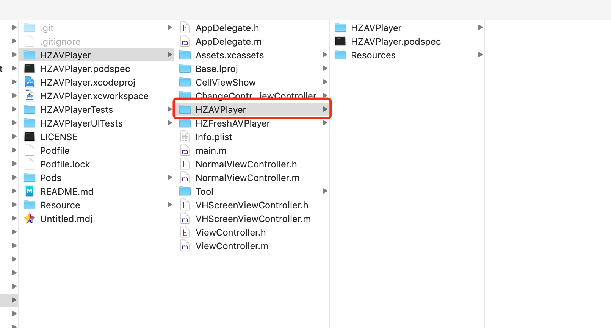
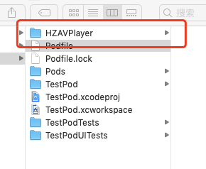
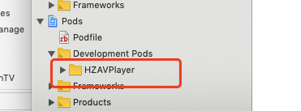
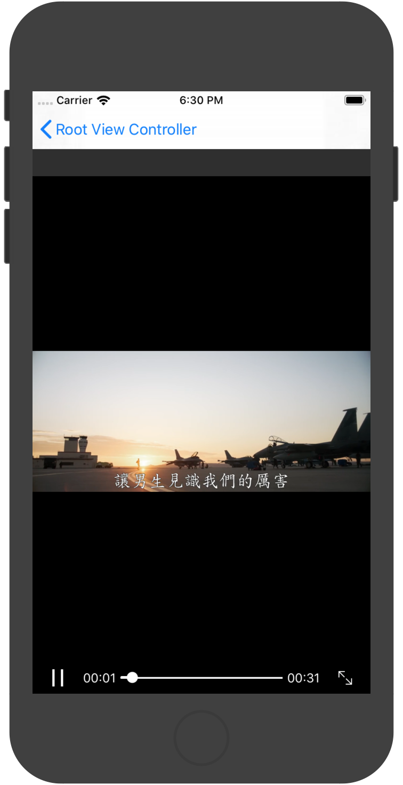
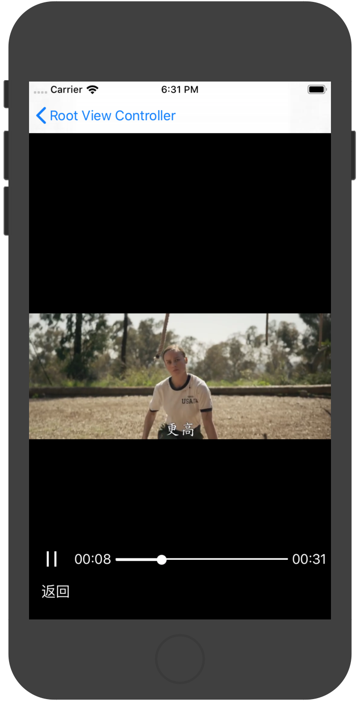
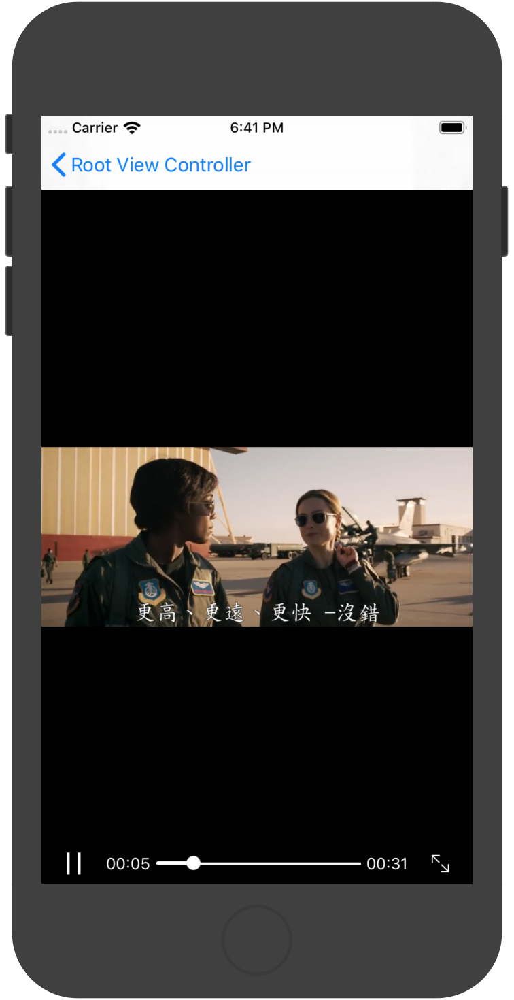

# HZAVPlayer

## 集成过程

- 先到项目根目录，也就是(项目.xcodepro)这个目录
-  找到`HZAVPlayer/HZAVPlayer`文件

<span><div style="text-align: center;">

</div></span>

- 放在(项目.xcodepro)这个目录

<span><div style="text-align: center;">

</div></span>

- 修改`Podfile`

```
platform :ios, '8.0'

inhibit_all_warnings!

#解决报[Xcodeproj] Generated duplicate UUIDs:
install! 'cocoapods', :deterministic_uuids => false

# 官方
source 'https://github.com/CocoaPods/Specs.git'

target 'TestPod' do
	
	pod 'HZAVPlayer', :path => 'HZAVPlayer'

end

```

- 打开终端

```
> cd Podfile目录下
> pod install

```

- 然后打开项目
<span><div style="text-align: center;">

</div></span>


## 介绍

|播放/缓存|cell上播放|修改默认控制模块的样式|横竖屏指定控制模块隐藏|
|:--:|:--:|:--:|:--:|
|||||

## 横屏

<span><div style="text-align: center;">
 
</div></span>


